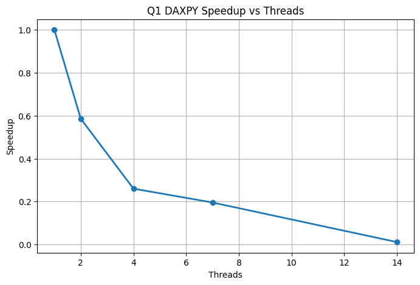

# Q1 – DAXPY Operation

## 1. Problem Summary  
- Performed the DAXPY operation `X[i] = a * X[i] + Y[i]`. 
- Parallelized the loop using OpenMP. 
- Measured execution time across different thread counts (1, 2, 4, 7, 14). 

## 2. Compilation & Execution
```
gcc -fopenmp Q1.c -o Q1
OMP_NUM_THREADS=<n> ./Q1
```

---

## 3. Performance Results

### 3.1 Execution Time Table

| Threads | Time (s)  | Speedup | Efficiency |
|--------|------------|---------|------------|
| **1**  | 0.000334   | 1.00x   | 100.00%    |
| **2**  | 0.000570   | 0.586x  | 29.3%      |
| **4**  | 0.001285   | 0.26x   | 6.5%       |
| **7**  | 0.001710   | 0.19x   | 2.7%       |
| **14** | 0.030707   | 0.0108x | 0.07%      |

---

## 3.2 Speedup Graph



---

## 4. Observations

- DAXPY is heavily memory bandwidth bound, so extra threads do not help. 
- The workload per thread is extremely small , OpenMP overhead dominates. 
- Performance becomes worse as threads increase , the best time is with 1 thread. 
- Hyperthreading (14 threads) makes performance drop sharply because 14 logical threads overload a 7 core CPU. 
- Efficiency collapses from 29% to 0.07%, showing strong Amdahl’s Law limitations. 
- Demonstrates that not all operations benefit from parallelism, especially small, memory bound kernels.

---

## 5. Amdahl’s Law Interpretation  
- DAXPY has a very small parallel region relative to total overhead. 
- The “parallel fraction” is extremely low, so speedup cannot grow. 
- After 1 to 2 threads, overhead > useful work, causing negative scaling. 
- This makes DAXPY a perfect example of when OpenMP parallelism is counterproductive.

---
