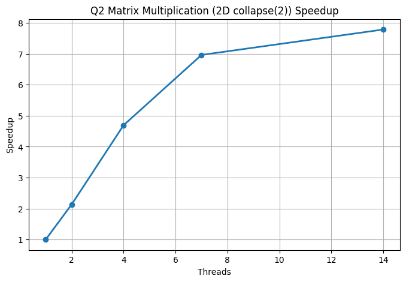

# Q2 – Matrix Multiplication

## 1. Problem Summary
- Implemented matrix multiplication using OpenMP.
- Part A (Q2): 1D parallelization using the outer i loop.
- Part B (Q2b): 2D parallelization using collapse(2) on i and j loops.
- Compared performance across thread counts 1, 2, 4, 7, and 14.

---

## 2. Compilation and Execution
```
gcc -fopenmp Q2.c -o Q2
gcc -fopenmp Q2b.c -o Q2b

./Q2 <threads>
./Q2b <threads>
```

---

## 3. Performance Results (1D Parallelization)

### 3.1 Execution Time Table

| Threads | Time (s) | Speedup | Efficiency |
|---------|----------|---------|------------|
| 1 | 3.733432 | 1.00x | 100.00% |
| 2 | 1.812951 | 2.06x | 103.00% |
| 4 | 0.851473 | 4.38x | 109.50% |
| 7 | 0.524830 | 7.11x | 101.60% |
| 14 | 0.494413 | 7.55x | 53.90% |

---

### 3.2 Speedup Graph


---

## 4. Observations (1D Parallelization)

- The 1D version scales well up to 7 threads, matching the number of physical cores.
- Speedup is nearly linear until 7 threads because matrix multiplication is computation heavy.
- Efficiency exceeds 100% for 2 and 4 threads due to improved cache locality in the parallel version.
- Performance flattens after 7 threads because memory bandwidth becomes a bottleneck.
- Hyperthreading (14 threads) provides a small improvement but efficiency drops significantly.
- Shows strong scaling until the limits of physical hardware are reached.

---

## 5. Amdahl’s Law Interpretation (1D)
- The parallel fraction is high, so speedup grows rapidly at low thread counts.
- After physical cores are saturated, memory stalls limit further speedup.
- The remaining sequential work and memory traffic dominate at high thread counts.
- Demonstrates practical Amdahl’s Law behavior for a computation intensive algorithm.

---

# --------------------------------------------------

# Q2b – Matrix Multiplication (collapse(2))

## 1. Problem Summary
- Same computation as Q2, but OpenMP uses collapse(2) to distribute both i and j loops.
- Creates more parallel work and improves load balancing.

---

## 2. Performance Results (2D Parallelization)

### 2.1 Execution Time Table

| Threads | Time (s) | Speedup | Efficiency |
|---------|----------|---------|------------|
| 1 | 3.836803 | 1.00x | 100.00% |
| 2 | 1.796741 | 2.13x | 106.50% |
| 4 | 0.817349 | 4.69x | 117.20% |
| 7 | 0.550884 | 6.96x | 99.40% |
| 14 | 0.492806 | 7.78x | 55.50% |

---

### 2.2 Speedup Graph



---

## 3. Observations (2D Parallelization)

- collapse(2) exposes more parallel work compared to 1D splitting.
- 2D version shows slightly better scaling than the 1D version.
- For 2 and 4 threads, efficiency exceeds 100%, indicating better cache usage.
- At 7 threads, the performance is similar to 1D because physical cores are fully saturated.
- At 14 threads, both versions flatten due to memory bandwidth saturation.
- The 2D version balances work more evenly among threads, reducing idle time.

---

## 4. Amdahl’s Law Interpretation (2D)
- Parallel fraction increases when using collapse(2), so speedup improves.
- However, memory wall effects still limit performance after 7 threads.
- Hyperthreading gives diminishing returns due to shared execution units.
- Demonstrates how algorithm structure affects achievable parallel speedup.

---
