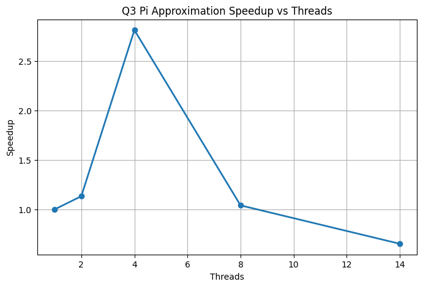

# Q3 – Pi Approximation

## 1. Problem Summary
- Approximated the value of pi using numerical integration.
- Divided the interval among threads using OpenMP.
- Each thread computed a partial sum independently and contributed to the final result.
- Measured performance for 1, 2, 4, 8, and 14 threads.

---

## 2. Compilation and Execution
```
gcc -fopenmp Q3.c -o Q3
OMP_NUM_THREADS=<n> ./Q3
```

---

## 3. Performance Results

### 3.1 Execution Time Table

| Threads | Time (s) | Speedup | Efficiency |
|---------|----------|---------|------------|
| 1 | 0.026773 | 1.00x | 100.00% |
| 2 | 0.023636 | 1.13x | 56.60% |
| 4 | 0.009508 | 2.81x | 70.20% |
| 8 | 0.025745 | 1.04x | 13.00% |
| 14 | 0.041135 | 0.65x | 4.60% |

---

### 3.2 Speedup Graph



---

## 4. Observations

- Pi approximation is an embarrassingly parallel problem for sufficiently large input sizes.
- For small workloads, OpenMP overhead becomes dominant and reduces performance at higher thread counts.
- Speedup improves up to 4 threads but decreases when using 8 and 14 threads.
- The drop in performance is due to thread creation overhead, scheduling overhead, and reduced work per thread.
- Hyperthreading significantly slows down execution because the task is too small and not computation heavy enough.
- The results show that parallelization benefits depend strongly on the workload size.

---

## 5. Amdahl’s Law Interpretation
- The parallel fraction is very high, but overhead limits the achievable speedup for small N.
- Speedup approaches linear up to 4 threads, after which overhead dominates.
- Beyond 7 physical cores, additional threads contribute little or even cause slowdown.
- Demonstrates that even highly parallel algorithms require sufficiently large work to benefit from many threads.

---

